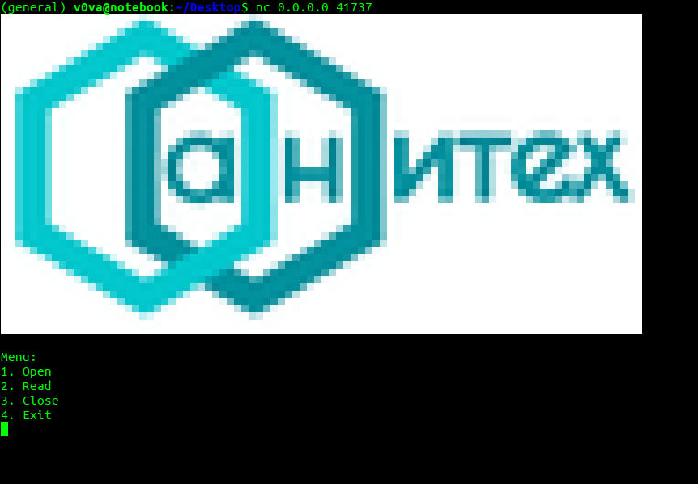

# Pwn | Files

## Информация

> Что может произойти, если дать возможность открывать обычные файлы?
> 
> _Спонсором данного таска выступила [АНО "АНИТЕХ"](https://anitekh.ru)._
> 
> `nc host 41737`
> 
> flag in `/tmp/flag.txt`


## Описание

Бинарник позволяет открывать, читать и закрывать файлы. Писать в файлы нельзя.

Вместе с бинарником выдаётся [Dockerfile](service/Dockerfile).




## Решение

Внимательно изучив Dockerfile, можно заметить, что создаётся `pty`, а это значит, что мы сможем использовать `/dev/stdin` в качестве файла. Также из Dockerfile можно понять используемую версию libc, если посмотреть на `ubuntu:16.04`.

При открытии `/dev/stdin` его размер считается как `-1`, и для него будет аллоцирован буфер минимального размера. С другой стороны, в кастомной структуре открытого файла размер имеет тип `unsigned`, а это значит, что при чтении из файла размер считываемых данных будет сравниваться с `0xFFFFFFFF`. Это приводит к возможному переполнению на куче.

Кастомная структура открытого файла:

```c
typedef struct file_t {
    int used;
    FILE* ptr;
    char* name;
    char* buffer;
    unsigned int size; 
} file_t;
```

Бинарник даёт возможность открыть только два файла одновременно. Имея переполнение чанка для первого открытого файла, можно испортить чанки или файловые структуры для второго открытого файла, так как они аллоцируются после первого. Один из вариантов — подменить указатели в таблице функций на `one_gadget`.

[Пример решения](exploit.py)


## Флаг

`Cup{0h_1_kn3w_y0u_l1k3_f1l3_s7ruc7ur35!}`
